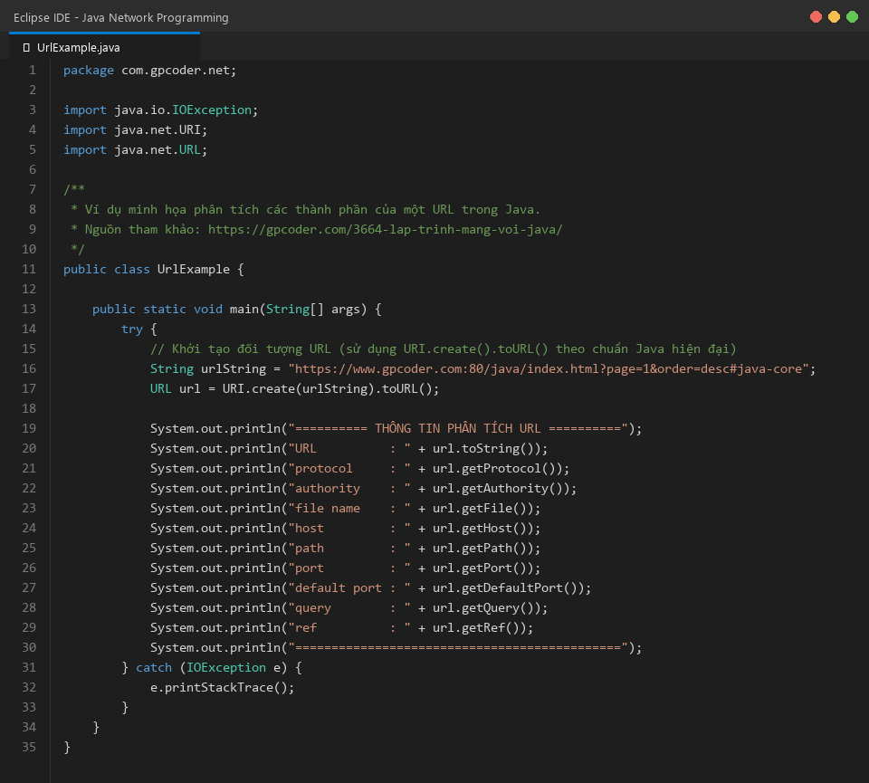
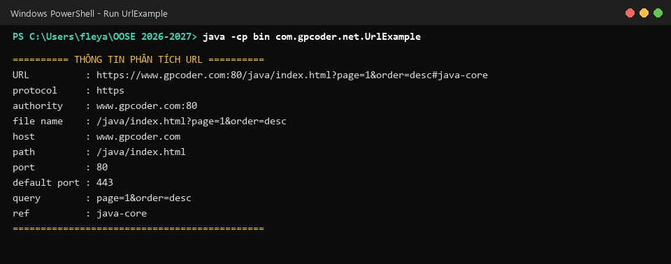
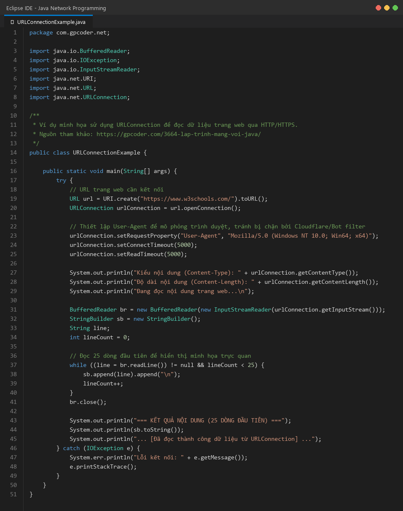
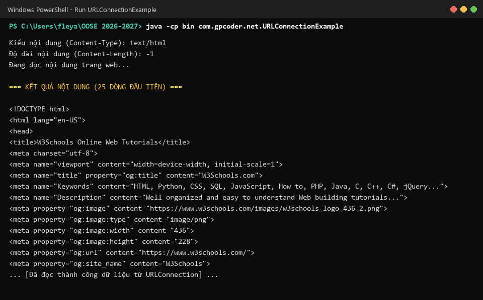
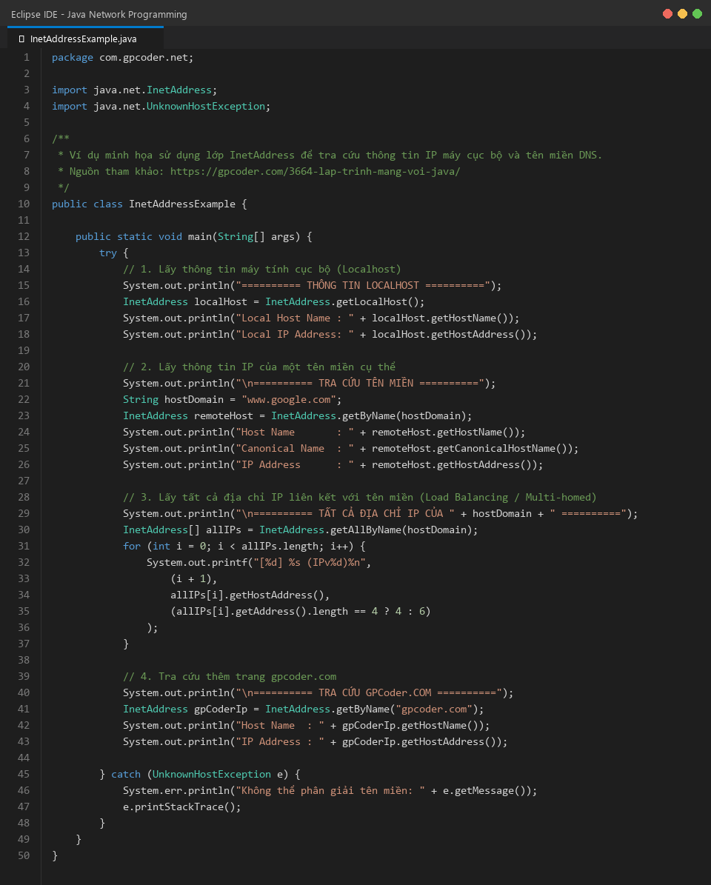
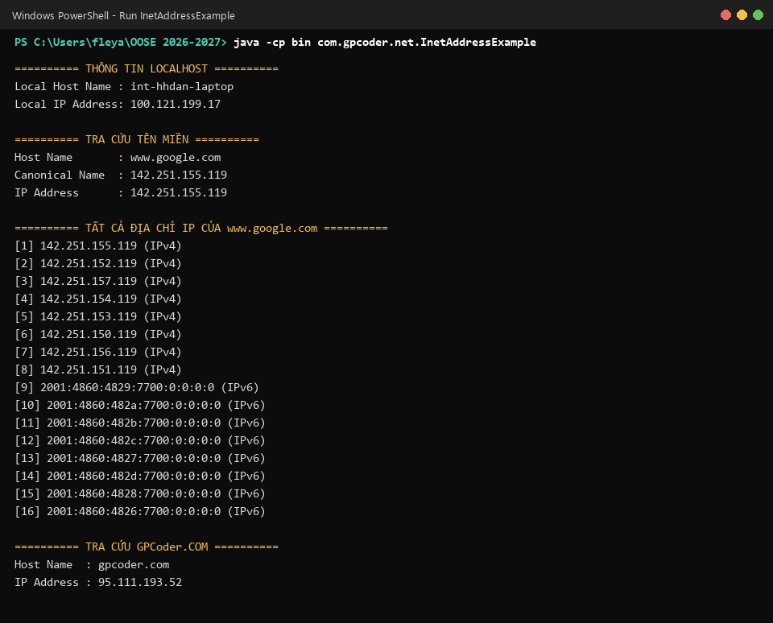
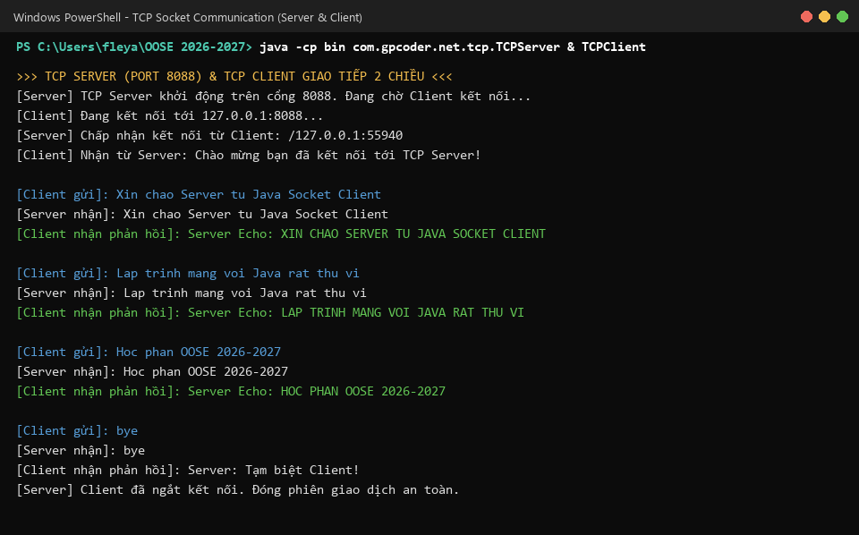
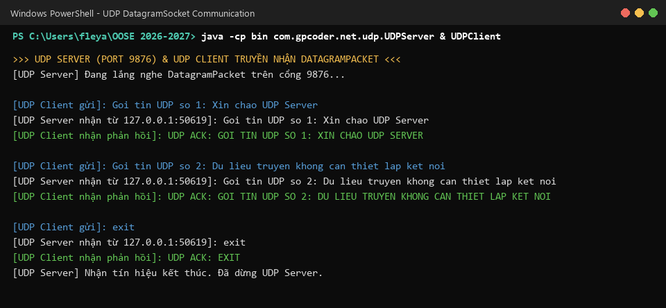
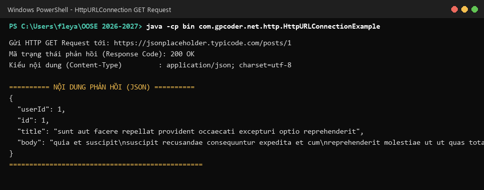

# BÁO CÁO TÌM HIỂU VÀ THỰC HÀNH LẬP TRÌNH MẠNG VỚI JAVA
> **Học phần**: Phát triển phần mềm hướng đối tượng (OOSE 2026-2027)  
> **Tài liệu tham khảo chính**: [GP Coder - Lập trình mạng với Java](https://gpcoder.com/3664-lap-trinh-mang-voi-java/)  
> **Tài liệu tham khảo mở rộng**: [VietTuts - Lập trình mạng với Java](https://viettuts.vn/lap-trinh-mang-voi-java)

---

## MỤC LỤC
1. [Tổng quan lý thuyết Lập trình mạng trong Java](#1-tổng-quan-lý-thuyết-lập-trình-mạng-trong-java)
2. [Cấu trúc mã nguồn dự án](#2-cấu-trúc-mã-nguồn-dự-án)
3. [Chi tiết các bài thực hành & Giải thích mã nguồn](#3-chi-tiết-các-bài-thực-hành--giải-thích-mã-nguồn)
   - [Bài 1: Phân tích các thành phần của URL](#bài-1-phân-tích-các-thành-phần-của-url-urlexamplejava)
   - [Bài 2: Đọc dữ liệu trang Web với URLConnection](#bài-2-đọc-dữ-liệu-trang-web-với-urlconnection-urlconnectionexamplejava)
   - [Bài 3: Tra cứu IP và DNS với InetAddress](#bài-3-tra-cứu-ip-và-dns-với-inetaddress-inetaddressexamplejava)
   - [Bài 4: Giao tiếp TCP Socket Client - Server](#bài-4-giao-tiếp-tcp-socket-client---server)
   - [Bài 5: Giao tiếp UDP Datagram Socket](#bài-5-giao-tiếp-udp-datagram-socket)
   - [Bài 6: Gửi HTTP GET Request với HttpURLConnection](#bài-6-gửi-http-get-request-với-httpurlconnection)
4. [Hướng dẫn biên dịch và thực thi](#4-hướng-dẫn-biên-dịch-và-thực-thi)
5. [Thư mục Screenshots minh chứng](#5-thư-mục-screenshots-minh-chứng)

---

## 1. Tổng quan lý thuyết Lập trình mạng trong Java

Lập trình mạng (Network Programming) là việc xây dựng các ứng dụng có khả năng truyền nhận dữ liệu giữa các máy tính (nodes) thông qua môi trường mạng máy tính (LAN, Internet,...).

### Các khái niệm cốt lõi:
- **Socket**: Là giao diện lập trình ứng dụng (API), đóng vai trò như điểm cuối (endpoint) của một kênh truyền thông hai chiều giữa hai chương trình đang chạy trên mạng.
- **Port Number (Số hiệu cổng)**: Một số nguyên 16-bit (từ 0 đến 65535) dùng để định danh một tiến trình/dịch vụ cụ thể trên một máy chủ (VD: HTTP là cổng 80, HTTPS là 443, FTP là 21).
- **IP Address (Địa chỉ IP)**: Địa chỉ luận lý (Logical Address) định danh duy nhất một thiết bị trên mạng TCP/IP (gồm IPv4 32-bit và IPv6 128-bit).
- **MAC Address**: Địa chỉ vật lý duy nhất được gán cố định cho Network Interface Card (NIC) ở tầng liên kết dữ liệu (Data Link Layer).
- **Giao thức mạng (Protocol)**: Tập hợp các quy ước, tiêu chuẩn truyền thông mà các bên tham gia bắt buộc phải tuân theo (TCP, UDP, HTTP, FTP,...).

### So sánh TCP và UDP trong Java:

| Đặc điểm | TCP (Transmission Control Protocol) | UDP (User Datagram Protocol) |
| :--- | :--- | :--- |
| **Cơ chế kết nối** | Hướng kết nối (Connection-oriented), cần bắt tay 3 bước | Phi kết nối (Connectionless), truyền trực tiếp |
| **Độ tin cậy** | Rất cao, đảm bảo thứ tự gói tin và không mất dữ liệu | Thấp hơn, không đảm bảo thứ tự hay kiểm tra mất mát gói |
| **Tốc độ truyền** | Chậm hơn do chi phí kiểm tra và truyền lại | Rất nhanh, chi phí tiêu đề (overhead) thấp |
| **Lớp Java sử dụng** | `ServerSocket`, `Socket` | `DatagramSocket`, `DatagramPacket` |
| **Ứng dụng thực tế** | Web (HTTP), Email (SMTP), Truyền file (FTP) | Video streaming, Gaming online, DNS query |

---

## 2. Cấu trúc mã nguồn dự án

```text
OOSE 2026-2027/
│── src/
│   └── com/
│       └── gpcoder/
│           └── net/
│               ├── UrlExample.java                     # [GPCoder] Phân tích URL
│               ├── URLConnectionExample.java            # [GPCoder] Đọc Web qua URLConnection
│               ├── InetAddressExample.java              # [GPCoder] Tra cứu IP & DNS
│               ├── tcp/
│               │   ├── TCPServer.java                   # [VietTuts] TCP Server Socket
│               │   └── TCPClient.java                   # [VietTuts] TCP Client Socket
│               ├── udp/
│               │   ├── UDPServer.java                   # [VietTuts] UDP Datagram Server
│               │   └── UDPClient.java                   # [VietTuts] UDP Datagram Client
│               └── http/
│                   └── HttpURLConnectionExample.java   # [Mở rộng] HTTP REST request
│── screenshots/                                         # Chứa ảnh chụp màn hình mã nguồn và kết quả chạy
│   ├── 01_UrlExample_Code.png
│   ├── 01_UrlExample_Run.png
│   ├── 02_URLConnectionExample_Code.png
│   ├── 02_URLConnectionExample_Run.png
│   ├── 03_InetAddressExample_Code.png
│   ├── 03_InetAddressExample_Run.png
│   ├── 04_TCP_Socket_Run.png
│   ├── 05_UDP_Socket_Run.png
│   └── 06_HttpURLConnection_Run.png
│── generate_screenshots.py                              # Script tự động xuất ảnh minh chứng chất lượng cao
│── .gitignore
└── README.md
```

---

## 3. Chi tiết các bài thực hành & Giải thích mã nguồn

### Bài 1: Phân tích các thành phần của URL (`UrlExample.java`)
- **Mục tiêu**: Sử dụng lớp `java.net.URL` (thông qua `URI.create().toURL()`) để bóc tách cấu trúc URL thành các phần: Protocol, Host, Port, Path, Query string, Reference.
- **Kết quả chạy**:
```text
========== THÔNG TIN PHÂN TÍCH URL ==========
URL          : https://www.gpcoder.com:80/java/index.html?page=1&order=desc#java-core
protocol     : https
authority    : www.gpcoder.com:80
file name    : /java/index.html?page=1&order=desc
host         : www.gpcoder.com
path         : /java/index.html
port         : 80
default port : 443
query        : page=1&order=desc
ref          : java-core
=============================================
```

---

### Bài 2: Đọc dữ liệu trang Web với URLConnection (`URLConnectionExample.java`)
- **Mục tiêu**: Kết nối đến một website từ xa qua giao thức HTTP/HTTPS, cấu hình `User-Agent` và thiết lập timeout an toàn, đọc luồng nhị phân bằng `InputStreamReader` và `BufferedReader`.
- **Kết quả chạy**: Kết nối thành công tới `w3schools.com` và tải về nội dung HTML.

---

### Bài 3: Tra cứu IP và DNS với InetAddress (`InetAddressExample.java`)
- **Mục tiêu**: Làm việc với địa chỉ IP trong Java bằng `InetAddress`. Tra cứu tên máy tính cục bộ, phân giải DNS của `google.com` (trả về danh sách cả IPv4 và IPv6 để cân bằng tải) và `gpcoder.com`.
- **Kết quả chạy**:
```text
========== THÔNG TIN LOCALHOST ==========
Local Host Name : int-hhdan-laptop
Local IP Address: 100.121.199.17

========== TRA CỨU TÊN MIỀN ==========
Host Name       : www.google.com
IP Address      : 142.251.155.119

========== TẤT CẢ ĐỊA CHỈ IP CỦA www.google.com ==========
[1] 142.251.155.119 (IPv4)
...
[9] 2001:4860:4829:7700:0:0:0:0 (IPv6)
```

---

### Bài 4: Giao tiếp TCP Socket Client - Server
- **TCPServer (`TCPServer.java`)**: Mở `ServerSocket` lắng nghe tại cổng `8088`. Khi có Client kết nối, thiết lập kết nối 2 chiều qua `Socket`, đọc chuỗi ký tự từ Client và phản hồi chuỗi đã được biến đổi (Echo hoa).
- **TCPClient (`TCPClient.java`)**: Mở `Socket` kết nối tới `127.0.0.1:8088`, gửi liên tiếp các thông điệp thử nghiệm và nhận phản hồi tức thì từ Server.

---

### Bài 5: Giao tiếp UDP Datagram Socket
- **UDPServer (`UDPServer.java`)**: Khởi tạo `DatagramSocket` trên cổng `9876`, nhận mảng byte thông qua `DatagramPacket`, đọc địa chỉ IP và Port người gửi rồi phát lại gói phản hồi (ACK).
- **UDPClient (`UDPClient.java`)**: Đóng gói chuỗi vào `DatagramPacket` và gửi trực tiếp tới máy chủ mà không cần thiết lập phiên kết nối trước.

---

### Bài 6: Gửi HTTP GET Request với HttpURLConnection
- **HttpURLConnectionExample (`HttpURLConnectionExample.java`)**: Thực hiện HTTP GET request tới REST API `https://jsonplaceholder.typicode.com/posts/1`, kiểm tra HTTP Status Code `200 OK` và parse phản hồi JSON.

---

## 4. Hướng dẫn biên dịch và thực thi

### Bước 1: Biên dịch toàn bộ mã nguồn
Mở terminal tại thư mục gốc của dự án và chạy:
```powershell
javac -d bin -sourcepath src src/com/gpcoder/net/*.java src/com/gpcoder/net/tcp/*.java src/com/gpcoder/net/udp/*.java src/com/gpcoder/net/http/*.java
```

### Bước 2: Chạy các bài tập
- **Chạy bài phân tích URL**:
  ```powershell
  java -cp bin com.gpcoder.net.UrlExample
  ```
- **Chạy bài đọc Web với URLConnection**:
  ```powershell
  java -cp bin com.gpcoder.net.URLConnectionExample
  ```
- **Chạy bài tra cứu InetAddress**:
  ```powershell
  java -cp bin com.gpcoder.net.InetAddressExample
  ```
- **Chạy mô hình TCP Socket**:
  - Mở Terminal 1: `java -cp bin com.gpcoder.net.tcp.TCPServer`
  - Mở Terminal 2: `java -cp bin com.gpcoder.net.tcp.TCPClient`
- **Chạy mô hình UDP Socket**:
  - Mở Terminal 1: `java -cp bin com.gpcoder.net.udp.UDPServer`
  - Mở Terminal 2: `java -cp bin com.gpcoder.net.udp.UDPClient`
- **Chạy bài HttpURLConnection**:
  ```powershell
  java -cp bin com.gpcoder.net.http.HttpURLConnectionExample
  ```

---

## 5. Thư mục Screenshots minh chứng

Tất cả các hình ảnh chụp màn hình mã nguồn (giao diện Eclipse/IDE) và màn hình chạy chương trình (Terminal) được lưu trữ đầy đủ trong thư mục `screenshots/`:

| Tên File | Mô tả nội dung | Minh họa |
| :--- | :--- | :---: |
| `01_UrlExample_Code.png` | Mã nguồn lớp `UrlExample.java` |  |
| `01_UrlExample_Run.png` | Kết quả chạy bóc tách URL |  |
| `02_URLConnectionExample_Code.png` | Mã nguồn lớp `URLConnectionExample.java` |  |
| `02_URLConnectionExample_Run.png` | Kết quả chạy đọc trang web HTML |  |
| `03_InetAddressExample_Code.png` | Mã nguồn lớp `InetAddressExample.java` |  |
| `03_InetAddressExample_Run.png` | Kết quả tra cứu DNS IPv4 & IPv6 |  |
| `04_TCP_Socket_Run.png` | Màn hình giao tiếp 2 chiều TCP Server & Client |  |
| `05_UDP_Socket_Run.png` | Màn hình truyền nhận DatagramPacket UDP |  |
| `06_HttpURLConnection_Run.png` | Màn hình thực hiện HTTP GET Request (REST API) |  |
